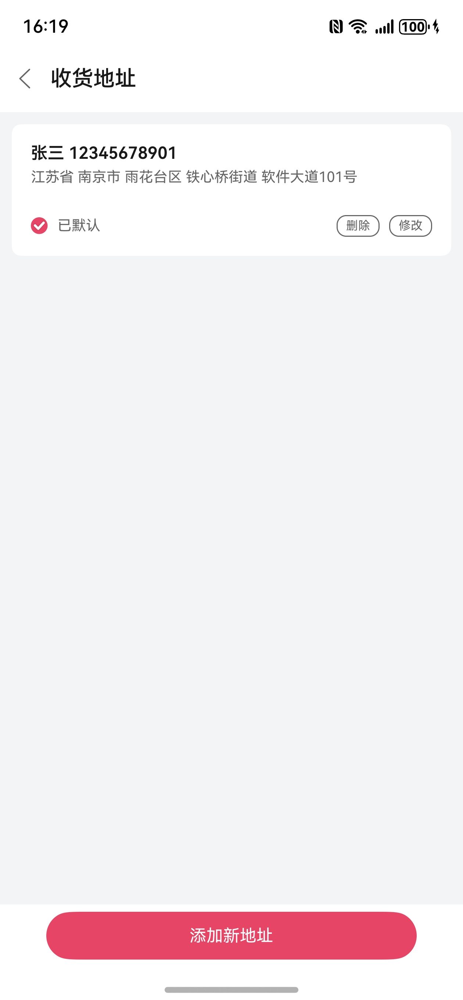
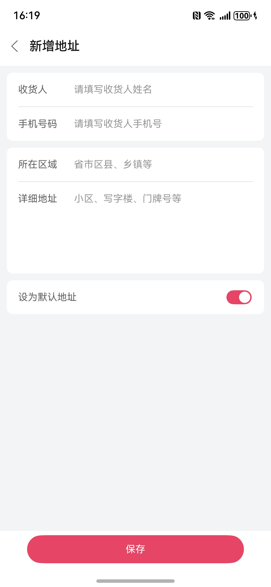

# 地址管理组件快速入门

## 目录

- [简介](#简介)
- [约束与限制](#约束与限制)
- [快速入门](#快速入门)
- [API参考](#API参考)
- [示例代码](#示例代码)

## 简介

本组件提供地址管理场景组件。

| 地址列表                                         | 地址编辑                                         |
|----------------------------------------------|----------------------------------------------|
|  |  |

## 约束与限制

### 环境

* DevEco Studio版本：DevEco Studio 5.0.4 Release及以上
* HarmonyOS SDK版本：HarmonyOS 5.0.4 Release SDK及以上
* 设备类型：华为手机（直板机）
* HarmonyOS版本：HarmonyOS 5.0.4 Release及以上

### 权限

* 网络权限：ohos.permission.INTERNET

### 服务

* 华为账号收货地址管理服务：组件支持获取华为账号收货地址，使用此功能需满足一定条件。详细参考：[收货地址服务开发前提](https://developer.huawei.com/consumer/cn/doc/harmonyos-guides/account-choose-address-dev#section1061219267293)。

## 快速入门

1. 安装组件。

   如果是在DevEvo Studio使用插件集成组件，则无需安装组件，请忽略此步骤。

   如果是从生态市场下载组件，请参考以下步骤安装组件。

   a. 解压下载的组件包，将包中所有文件夹拷贝至您工程根目录的XXX目录下。

   b. 在项目根目录build-profile.json5添加module_address_manage模块。

   ```
   // 项目根目录下build-profile.json5填写module_address_manage路径。其中XXX为组件存放的目录名
   "modules": [
     {
       "name": "module_address_manage",
       "srcPath": "./XXX/module_address_manage"
     }
   ]
   ```

   ```
   // 在项目根目录oh-package.json5中添加依赖
   "dependencies": {
     "module_address_manage": "file:./XXX/module_address_manage"
   }
   ```

2. 引入组件。

   ```
   import { AddressManage, AddressDTO } from 'module_address_manage';
   ```

## API参考

### getDefaultAddress(Promise<[AddressDTO](#AddressDTO) | undefined>)

**获取默认地址**

### AddressManage(option: AddressManageOptions)

**AddressManageOptions对象说明**

| 参数名               | 类型                                                     | 必填            | 说明                    |
|:------------------|:-------------------------------------------------------|:--------------|:----------------------|
| navPathStack      | NavPathStack                                           | 是             | Navigation路由栈实例       |
| isSelectMode      | boolean                                                | 否             | 是否开启地址选择模式            |
| onSelect          | (address: [AddressDTO](#AddressDTO)) => void           | 否             | 选择地址后的回调              |
| onBeforeNavigate  | () => boolean                                          | 否             | 页面跳转前的回调，返回false将取消跳转 |

### AddressDTO

表示地址数据的结构体，用于页面组件传入、组件内部管理，或作为网络接口的请求/响应格式。

| 字段名              | 类型          | 必填  | 说明                  |
|------------------|-------------|-----|---------------------|
| `id`             | `string`    | 是   | 地址唯一标识符             |
| `name`           | `string`    | 是   | 姓名                  |
| `phone`          | `string`    | 是   | 手机号                 |
| `countryCode`    | `string`    | 是   | 国家代码（如 `"CN"` 表示中国） |
| `country`        | `string`    | 是   | 国家名称（如 `"中国"`）      |
| `province`       | `string`    | 是   | 所在省份                |
| `city`           | `string`    | 是   | 所在城市                |
| `district`       | `string`    | 是   | 所在区/县               |
| `street`         | `string`    | 是   | 街道名称（如乡镇、街道）        |
| `detail`         | `string`    | 是   | 详细地址（如门牌号、楼栋房间号）    |
| `isDefault`      | `boolean`   | 是   | 是否为默认地址             |
| `createdAt`      | `number`    | 是   | 创建时间戳（毫秒）           |
| `updatedAt`      | `number`    | 是   | 更新时间戳（毫秒）           |

## 示例代码

```
import { AddressManage, AddressDTO } from 'module_address_manage';

@Entry
@ComponentV2
struct Index {
  private readonly TAG: string = 'AddressManageDemo';

  private navPathStack: NavPathStack = new NavPathStack()

  public build(): void {
    Navigation(this.navPathStack) {
      Column() {
        AddressManage({
          navPathStack: this.navPathStack,
          isSelectMode: true,
          onSelect: (address: AddressDTO) => {
            console.info(this.TAG, '当前所选地址：' + JSON.stringify(address));
          },
          onBeforeNavigate: () => {
            console.info(this.TAG, '页面跳转');
            return true;
          }
        }) {
          Button('地址管理')
        }
      }
      .width('100%')
      .height('100%')
      .justifyContent(FlexAlign.Center)
    }
    .hideTitleBar(true)
  }
}
```
