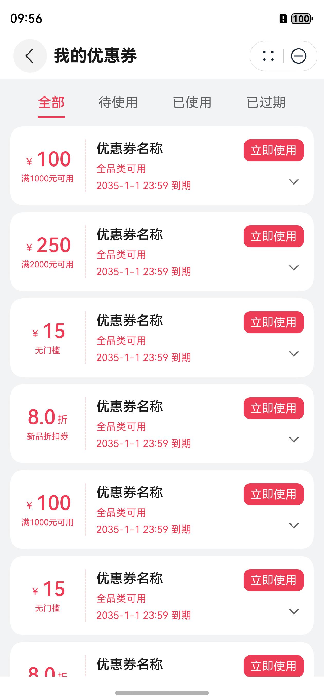
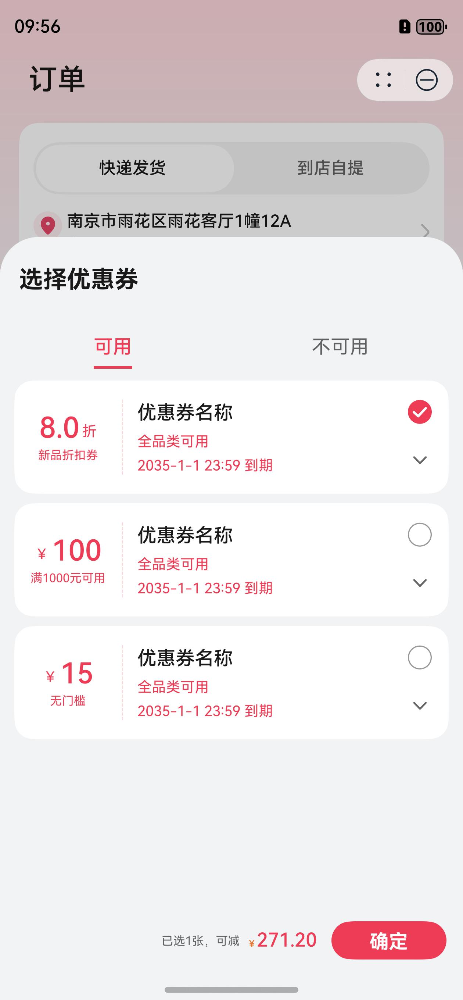
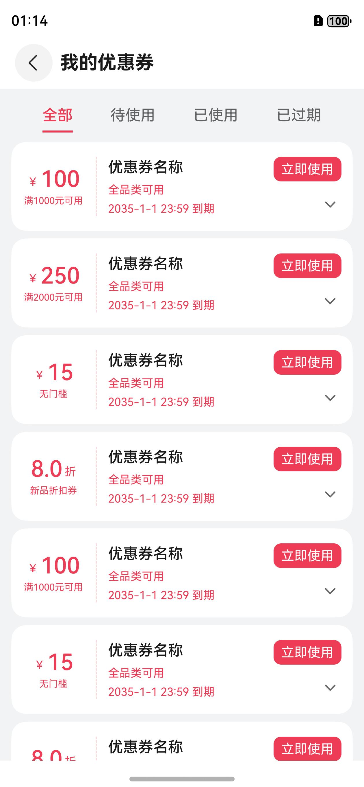
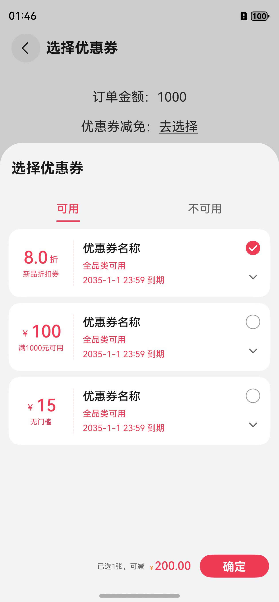
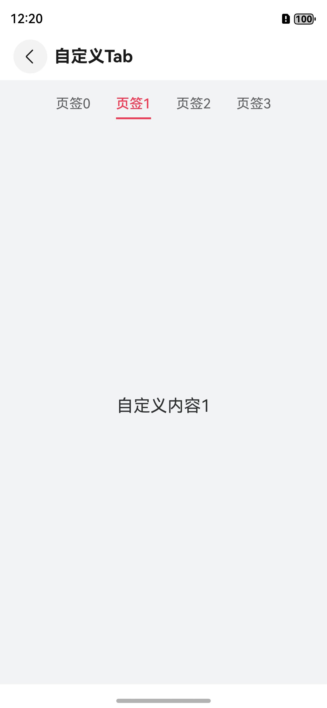

# 优惠券组件快速入门

## 目录

- [简介](#简介)
- [约束与限制](#约束与限制)
- [快速入门](#快速入门)
- [API参考](#API参考)
- [示例代码](#示例代码)

## 简介

本模块提供了优惠券的浏览与选择的能力，可以帮助开发者快速集成优惠券的相关业务。

| 浏览                                                            | 选择                                                             |
|---------------------------------------------------------------|----------------------------------------------------------------|
|  |  |

## 约束与限制

### 环境

* DevEco Studio版本：DevEco Studio 5.0.0 Release及以上
* HarmonyOS SDK版本：HarmonyOS 5.0.0 Release SDK及以上
* 设备类型：华为手机（直板机）
* HarmonyOS版本：HarmonyOS 5.0.0 Release及以上

### 权限

* 网络权限：ohos.permission.INTERNET

## 快速入门

1. 安装组件。

   如果是在DevEvo Studio使用插件集成组件，则无需安装组件，请忽略此步骤。

   如果是从生态市场下载组件，请参考以下步骤安装组件。

   a. 解压下载的组件包，将包中所有文件夹拷贝至您工程根目录的XXX目录下。

   b. 在项目根目录build-profile.json5添加module_coupons模块。

   ```
   // 项目根目录下build-profile.json5填写module_coupons路径。其中XXX为组件存放的目录名
   "modules": [
      {
      "name": "module_coupons",
      "srcPath": "./XXX/module_coupons"
      }
   ]
   ```

   ```
   // 在项目根目录oh-package.json5中添加依赖
   "dependencies": {
      "module_coupons": "file:./XXX/module_coupons"
   }
   ```

2. 引入组件句柄。

   ```
   import { Coupons, MyCouponsView } from 'module_coupons';
   ```

3. 浏览优惠券。详细入参配置说明参见[API参考](#API参考)。

   ```
   MyCouponsView({
      useNow: couponId => {
         Logger.info(TAG, couponId);
         emitter.emit(EmitterConstants.TO_HOME);
         RouterModule.pop();
      },
   })
   ```

4. 选择优惠券。详细入参配置说明参见[API参考](#API参考)。

   ```
   Coupons.select({
      totalMoney: this.totalMoney,
      selectId: this.couponId,
      confirm: params => {
         this.couponId = params.selectId;
         this.reduce = params.reduce;
      },
   });
   ```

## API参考

### 子组件

无

### Coupons

优惠券管理类。

| 方法                                                        | 入参                 | 说明           |
|-----------------------------------------------------------|--------------------|--------------|
| select(params: [SelectCouponParams](#SelectCouponParams)) | SelectCouponParams | 开启选择优惠券半模态弹窗 |
| close()                                                   | 无                  | 关闭选择优惠券半模态弹窗 |

### SelectCouponParams

选择优惠券入参类型。

| 参数         | 类型                                            | 必填 | 说明       |
|------------|-----------------------------------------------|----|----------|
| totalMoney | number                                        | 是  | 订单总金额    |
| selectId   | string                                        | 是  | 已选优惠券ID  |
| confirm    | (params: [OnPopParams](#OnPopParams)) => void | 否  | 确定按钮执行回调 |

### OnPopParams

确定按钮回调传递数据类型。

| 参数       | 类型     | 必填 | 说明               |
|----------|--------|----|------------------|
| reduce   | number | 是  | 减免金额，为空时为0       |
| selectId | string | 是  | 选择优惠券ID，为空时为空字符串 |

### MyCouponsView

浏览我的优惠券组件。

| 参数     | 类型                         | 必填 | 说明                      |
|--------|----------------------------|----|-------------------------|
| useNow | (couponId: string) => void | 否  | 立即使用按钮，执行回调事件。传递当前优惠券ID |

### TabComp

自定义带导航条动画的Tab组件。

| 参数                | 类型                             | 必填 | 说明                |
|-------------------|--------------------------------|----|-------------------|
| tabBar            | string[]                       | 是  | 页签名数组             |
| index             | number                         | 否  | 初始Tab页索引,支持!!双向绑定 |
| contentUi         | (index: number) => void        | 否  | 自定义内容区域           |
| tabBarUi          | () => void                     | 否  | 页签居左时，自定义尾部页签区域   |
| top               | boolean                        | 否  | 页签所处位置: 默认居顶      |
| start             | boolean                        | 否  | 页签对齐方式: 默认居中      |
| friction          | number \| Resource             | 否  | 页签居左可滚动时，设置的摩擦系数  |
| space             | number                         | 否  | 页签间隙              |
| offsetLeft        | number                         | 否  | 页签左边距             |
| offsetRight       | number                         | 否  | 页签右边距             |
| activeColor       | ResourceColor                  | 否  | 选中文字颜色，包括导航条      |
| frozenColor       | ResourceColor                  | 否  | 正常文字颜色            |
| activeSize        | string \| number \| Resource   | 否  | 选中文字大小            |
| frozenSize        | string \| number \| Resource   | 否  | 正常文字大小            |
| activeWeight      | number \| string \| FontWeight | 否  | 选中文字粗细            |
| frozenWeight      | number \| string \| FontWeight | 否  | 正常文字粗细            |
| tabBarBgColor     | ResourceColor                  | 否  | 页签区背景颜色           |
| tabContentBgColor | ResourceColor                  | 否  | 内容背景颜色            |
| animationDuration | number                         | 否  | 动画时长              |
| tabBarHeight      | Length                         | 否  | 导航区高度             |
| lineHeight        | Length                         | 否  | 导航条高度             |
| relativeY         | number                         | 否  | 条形相对页签的垂直位置       |

## 示例代码

### 浏览优惠券

本示例通过MyCouponsView组件搭建我的优惠券页面。

```
import { MyCouponsView } from 'module_coupons';

@Entry
@ComponentV2
struct CouponsShow {
  build() {
    Navigation() {
      MyCouponsView({
        useNow: (couponId) => {
          console.log('[CouponDetail]', couponId);
        },
      })
    }
    .titleMode(NavigationTitleMode.Mini)
    .title('我的优惠券')
  }
}
```



### 选择优惠券

本示例通过Coupons.select方法拉起半模态、实现优惠券的选择。

```
import { Coupons } from 'module_coupons';

@Entry
@ComponentV2
struct CouponsSelect {
  @Local totalMoney: number = 1000;
  @Local selectId: string = '';
  @Local reduce: number = 0;
  
  build() {
    Navigation() {
      Column({ space: 20 }) {
        Text('订单金额：' + this.totalMoney).fontSize(18)
        Row() {
          Text('优惠券减免：').fontSize(18)
          Text(this.reduce !== 0 ? this.reduce.toString() : '去选择')
            .fontSize(18)
            .decoration({ type: TextDecorationType.Underline })
            .onClick(() => {
              Coupons.select({
                totalMoney: this.totalMoney,
                selectId: this.selectId,
                confirm: (params) => {
                  this.selectId = params.selectId;
                  this.reduce = params.reduce;
                },
              })
            })
        }
      }
      .padding({ top: 30 })
      .justifyContent(FlexAlign.Start)
      .width('100%')
      .height('100%')
    }
    .titleMode(NavigationTitleMode.Mini)
    .title('选择优惠券')
  }
}
```



### 自定义Tab

本示例通过TabComp组件快速搭建自定义Tab。

```
import { TabComp } from 'module_coupons'

@Entry
@ComponentV2
struct CouponsTab {
  @Local index: number = 1;

  build() {
    Navigation() {
      TabComp({
        tabBar: ['页签0', '页签1', '页签2', '页签3'],
        index: this.index!!,
        space: 30,
        contentUi: (index) => {
          this.contentBuilder(index)
        },
      })
    }
    .titleMode(NavigationTitleMode.Mini)
    .title('自定义Tab')
  }

  @Builder
  contentBuilder(index: number) {
    Column() {
      Text('自定义内容' + index).fontSize(20)
    }.height('100%').justifyContent(FlexAlign.Center)
  }
}
```

