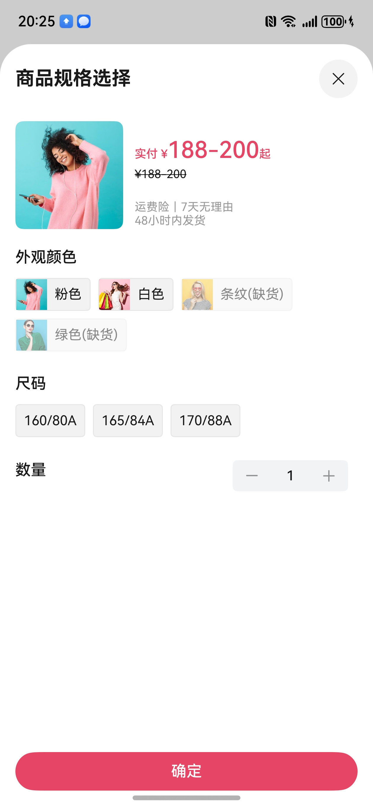

# 商品详情组件快速入门

## 目录

- [简介](#简介)
- [约束与限制](#约束与限制)
- [快速入门](#快速入门)
- [API参考](#API参考)
- [示例代码](#示例代码)

## 简介

本模板提供商品详情组件，支持商品详情的展示和商品规格选择。



## 约束与限制

### 环境

* DevEco Studio版本：DevEco Studio 5.0.1 Release及以上
* HarmonyOS SDK版本：HarmonyOS 5.0.1 Release SDK及以上
* 设备类型：华为手机（直板机）
* HarmonyOS版本：HarmonyOS 5.0.1 Release及以上

## 快速入门

1. 安装组件。

   如果是在DevEvo Studio使用插件集成组件，则无需安装组件，请忽略此步骤。
   
   如果是从生态市场下载组件，请参考以下步骤安装组件。
   
   a. 解压下载的组件包，将包中所有文件夹拷贝至您工程根目录的XXX目录下。
   
   b. 在项目根目录build-profile.json5添加module_product_detail模块。

   ```
   // 项目根目录下build-profile.json5填写module_product_detail路径。其中XXX为组件存放的目录名
   "modules": [
     {
       "name": "module_product_detail",
       "srcPath": "./XXX/module_product_detail"
     }
   ]
   ```

   ```
   // 在项目根目录oh-package.json5中添加依赖
   "dependencies": {
     "module_product_detail": "file:./XXX/module_product_detail"
   }
   ```

2. 引入组件。

   ```
   import { ProductDetail } from 'module_product_detail';
   ```

## API参考

ProductDetail(options: ProductDetailOptions)

#### ProductDetailOptions对象说明

| 名称           | 类型                                     | 是否必填 | 说明                                                                                                                                                 |
| -------------- | ---------------------------------------- | -------- | ---------------------------------------------------------------------------------------------------------------------------------------------------- |
| productId      | string                                   | 是       | 商品的唯一标识符，用于标识当前展示的商品。该id用于访问网络接口获取商品详情信息。mock状态下支持商品展示的productId为`product_10001` ~ `product_10008` |
| isLogin        | boolean                                  | 是       | 表示用户是否已登录，默认值为 `false`。                                                                                                               |
| cartProdNum    | number                                   | 是       | 购物车中商品的数量，默认值为 `0`。                                                                                                                   |
| clickCart      | () => void                               | 是       | 点击购物车图标时触发的事件回调函数，不接受参数，无返回值。                                                                                           |
| handleAddCart  | (skuCode: string, count: number) => void | 是       | 添加商品到购物车时触发的事件回调函数，接收商品的 SKU 码和数量。                                                                                      |
| handlePayNow   | (skuCode: string, count: number) => void | 是       | 点击立即购买时触发的事件回调函数，接收商品的 SKU 码和数量。                                                                                          |
| handleNotLogin | () => void                               | 是       | 用户未登录时触发的事件回调函数，用于处理未登录状态。                                                                                                 |

## 示例代码

```ts
import { promptAction } from '@kit.ArkUI';
import { ProductDetail } from 'module_product_detail';

@Entry
@ComponentV2
struct PreviewPage {
  @Local
  cartProdNum: number = 0;
  @Local
  skuList:string[] = []

  build() {
    Column() {
      ProductDetail({
        productId: 'product_10001',
        isLogin: true,
        cartProdNum: this.cartProdNum,
        clickCart: () => {
          promptAction.showToast({ message: `点击了购物车按钮，当前商品数量为${this.cartProdNum}` });
        },
        handleAddCart: (skuCode, count) => {
          promptAction.showToast({ message: `新添加了code为${skuCode}的商品，数量为${count}` });
          if(!this.skuList.includes(skuCode)){
            this.skuList.push(skuCode)
          }
          this.cartProdNum = this.skuList.length;
        },
        handlePayNow: (skuCode, count) => {
          promptAction.showToast({ message: `立即支付为${skuCode}的商品，数量为${count}` });
        },
      });
    };
  }
}
```


