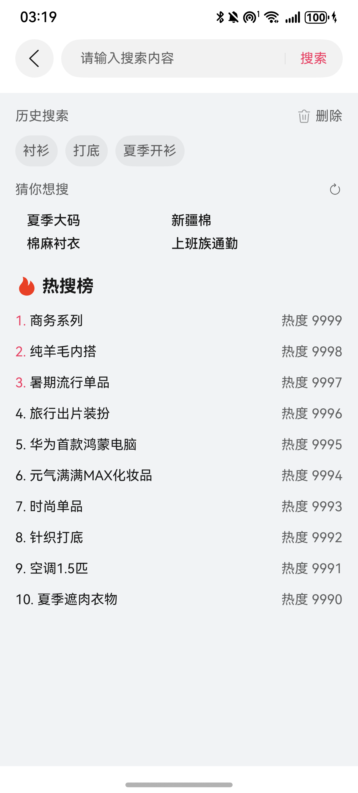

# 商品搜索组件快速入门

## 目录

- [简介](#简介)
- [约束与限制](#约束与限制)
- [快速入门](#快速入门)
- [API参考](#API参考)
- [示例代码](#示例代码)

## 简介

本模板提供商品搜索组件，可以查看并编辑搜索历史，查看并刷新推荐关键词，查看热搜榜。



## 约束与限制

### 环境

* DevEco Studio版本：DevEco Studio 5.0.1 Release及以上
* HarmonyOS SDK版本：HarmonyOS 5.0.1 Release SDK及以上
* 设备类型：华为手机（直板机）
* HarmonyOS版本：HarmonyOS 5.0.1 Release及以上

### 权限

* 网络权限：ohos.permission.INTERNET

## 快速入门

1. 安装组件。

   如果是在DevEvo Studio使用插件集成组件，则无需安装组件，请忽略此步骤。

   如果是从生态市场下载组件，请参考以下步骤安装组件。

   a. 解压下载的组件包，将包中所有文件夹拷贝至您工程根目录的XXX目录下。

   b. 在项目根目录build-profile.json5添加module_product_search模块。

   ```
   // 项目根目录下build-profile.json5填写module_product_search路径。其中XXX为组件存放的目录名
   "modules": [
     {
       "name": "module_product_search",
       "srcPath": "./XXX/module_product_search"
     }
   ]
   ```

   ```
   // 在项目根目录oh-package.json5中添加依赖
   "dependencies": {
     "module_product_search": "file:./XXX/module_product_search"
   }
   ```

2. 引入组件。

```
import { SearchView } from 'module_product_search';
```

## API参考

ProductShare(options: ProductShareOptions)

#### ProductDetailOptions对象说明

| 名称            | 类型                                                                                                                                                                                                                                                             | 是否必填 | 说明                              |
| --------------- |----------------------------------------------------------------------------------------------------------------------------------------------------------------------------------------------------------------------------------------------------------------| -------- |---------------------------------|
| defaultSearch        | string                                                                                                                     | 否       | 进入页面时搜索框显示的关键字，默认为空             |
| routerStack     | [NavPathStack](https://developer.huawei.com/consumer/cn/doc/harmonyos-references/ts-basic-components-navigation#navpathstack10) | 否       | 路由框架提供的导航控制器，不传则无法通过返回按钮回退上一页面。 |

### 事件

支持以下事件：

#### handleSearch

handleSearch: (value: string) => void
点击搜索按钮后触发该事件

## 示例代码

```ts
import { SearchView } from 'module_product_search';

@Entry
@ComponentV2
export struct PreviewPage2 {
  stack: NavPathStack = new NavPathStack();

  @Builder
  pageMap(name: string) {
    if (name === 'search') {
      SearchPage();
    }
  }

  build() {
    Navigation(this.stack) {
      Button('点击进入搜索页面')
        .onClick(() => {
          this.stack.pushPath({ name: 'search' });
        });
    }
    .navDestination(this.pageMap);
  }
}

@ComponentV2
export struct SearchPage {
  stack: NavPathStack = new NavPathStack();

  build() {
    NavDestination() {
      SearchView({
        routerStack: this.stack,
        handleSearch: (value) => {
          this.getUIContext().getPromptAction().showToast({
            message: '提交了搜索关键字: ' + value,
          });
        },
      });
    }
    .hideTitleBar(true)
    .onReady((context) => {
      this.stack = context.pathStack;
    });
  }
}
```

