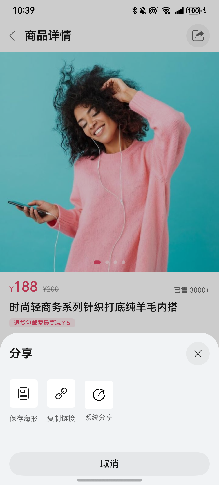

# 商品分享组件快速入门

## 目录

- [简介](#简介)
- [约束与限制](#约束与限制)
- [快速入门](#快速入门)
- [API参考](#API参考)
- [示例代码](#示例代码)

## 简介

本模板提供商品分享组件，支持保存商品为海报，复制商品链接，拉起华为系统分享和碰一碰分享功能。



## 约束与限制

### 环境

* DevEco Studio版本：DevEco Studio 5.0.1 Release及以上
* HarmonyOS SDK版本：HarmonyOS 5.0.1 Release SDK及以上
* 设备类型：华为手机（直板机）
* HarmonyOS版本：HarmonyOS 5.0.1 Release及以上

## 快速入门

1. 安装组件。

   如果是在DevEvo Studio使用插件集成组件，则无需安装组件，请忽略此步骤。

   如果是从生态市场下载组件，请参考以下步骤安装组件。

   a. 解压下载的组件包，将包中所有文件夹拷贝至您工程根目录的XXX目录下。

   b. 在项目根目录build-profile.json5添加module_product_share模块。

   ```
   // 项目根目录下build-profile.json5填写module_product_share路径。其中XXX为组件存放的目录名
   "modules": [
     {
       "name": "module_product_share",
       "srcPath": "./XXX/module_product_share"
     }
   ]
   ```

   ```
   // 在项目根目录oh-package.json5中添加依赖
   "dependencies": {
     "module_product_share": "file:./XXX/module_product_share"
   }
   ```

2. 引入组件。

   ```
   import { ProductShare } from 'module_product_share';
   ```

## API参考

ProductShare(options: ProductShareOptions)

#### ProductDetailOptions对象说明

| 名称            | 类型                                                         | 是否必填 | 说明                                                         |
| --------------- | ------------------------------------------------------------ | -------- | ------------------------------------------------------------ |
| customUI        | [CustomBuilder](https://developer.huawei.com/consumer/cn/doc/harmonyos-references-V14/ts-types-V14#custombuilder8) | 否       | 关联商品分享面板的自定义UI，点击可拉起分享面板。默认为一个分享按钮 |
| panelHeight     | [SheetSize](https://developer.huawei.com/consumer/cn/doc/harmonyos-references/ts-universal-attributes-sheet-transition#sheetsize%E6%9E%9A%E4%B8%BE%E8%AF%B4%E6%98%8E) \| [Length](https://developer.huawei.com/consumer/cn/doc/harmonyos-references/ts-types#length) | 否       | 分享面板高度，默认为300vp。                                  |
| productResource | [ProductResource](#ProductResource类型说明)                  | 是       | 商品分享所需的相关素材。                                     |

#### ProductResource类型说明

| 字段名 | 类型                                                         | 必填 | 说明     |
| ------ | ------------------------------------------------------------ | ---- | -------- |
| image  | [ResourceStr](https://developer.huawei.com/consumer/cn/doc/harmonyos-references/ts-types#resourcestr) | 是   | 商品图片 |
| title  | string                                                       | 是   | 商品标题 |
| price  | number                                                       | 是   | 商品价格 |
| url    | string                                                       | 是   | 商品链接 |


## 示例代码

```ts
import { ProductShare } from 'module_product_share';

@Entry
@ComponentV2
struct PreviewPage {
  build() {
    Column() {
      Column() {
        Image($r('app.media.mock_image')) // 开发者使用时替换为网络图片或自身工程内的资源
          .width('100%');
        Text('高端定制夏季法式粉色上衣2025新款女');
      }
      .width('100%')
      .padding(16);

      ProductShare({
        productResource: {
          image: $r('app.media.mock_image'), // 开发者使用时替换为网络图片或自身工程内的资源
          title: '高端定制夏季法式粉色上衣2025新款女',
          price: 1099,
          url: 'http://test',
        },
      }) {
        this.shareIcon();
      };
    }
    .height('100%')
    .width('100%');
  }

  @Builder
  shareIcon() {
    Button('点击分享');
  }
}
```

