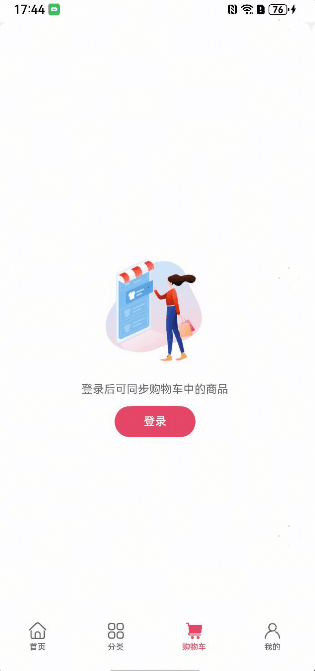

# 购物车组件快速入门

## 目录

- [简介](#简介)
- [约束与限制](#约束与限制)
- [快速入门](#快速入门)
- [API参考](#API参考)
- [示例代码](#示例代码)


## 约束与限制

### 环境

* DevEco Studio版本：DevEco Studio 5.0.1 Release及以上
* HarmonyOS SDK版本：HarmonyOS 5.0.1 Release SDK及以上
* 设备类型：华为手机（直板机）
* HarmonyOS版本：HarmonyOS 5.0.1 Release及以上

### 权限

* 网络权限：ohos.permission.INTERNET


## 简介

本组件展示了购物车商品列表信息和推荐商品信息，提供了商品选择、删除、增减商品数量、查看明细、结算、查看商品详情、查看推荐商品信息等相关功能，帮助开发者快速集成购物车相关的能力。


## 快速入门

1. 安装组件

   如果是在DevEvo Studio使用插件集成组件，则无需安装组件，请忽略此步骤。

   如果是从生态市场下载组件，请参考以下步骤安装组件。

   a. 解压下载的组件包，将包中所有文件夹拷贝至您工程根目录的XXX目录下。

   b. 在项目根目录build-profile.json5添加module_shopping_cart模块。

   ```
   // 项目根目录下build-profile.json5填写module_shopping_cart路径。其中XXX为组件存放的目录名
   "modules": [
     {
       "name": "module_shopping_cart",
       "srcPath": "./XXX/module_shopping_cart"
     }
   ]
   ```

   ```
   // 在项目根目录oh-package.json5中添加依赖
   "dependencies": {
     "module_shopping_cart": "file:./XXX/module_shopping_cart"
   }
   ```

2. 引入组件

   ```typescript
   import { ShoppingCart } from 'module_shopping_cart';
   ```

3. 调用组件，详细参数配置说明参见[API参考](#API参考)。

   ```typescript
   import { ShoppingCart } from 'module_shopping_cart';
   import { Product } from 'module_shopping_cart/src/main/ets/commons/Model';
   
   @Entry
   @ComponentV2
   struct DemoPage {
     @Local isChildRoute: boolean = false
     @Local isLogin: boolean = true
   
     build() {
       Column(){
         ShoppingCart({
           isChildRoute: this.isChildRoute,
           isLogin: this.isLogin,
           customContentBuilder: () => {
             // TODO 自定义模块，推荐商品
           },
           onLogin: () => {
             // TODO 登录逻辑
           },
           onCardClick: (productId: string) => {
             // TODO 点击购物车卡片
           },
           onBack: () => {
             // TODO 返回事件
           },
           onCheckout: (selectedList: Product[]) => {
             // TODO 结算逻辑
           }
         })
       }
     }
   }
   ```


## API参考

#### 子组件

无

#### 接口

ShoppingCart(options?:ShoppingCartOptions)

购物车组件。

**参数：**

| 参数名  | 类型                | 是否必填 | 说明                 |
| ------- | ------------------- | -------- | -------------------- |
| options | [ShoppingCartOptions](#ShoppingCartOptions对象说明) | 否       | 配置购物车组件的参数 |


#### ShoppingCartOptions对象说明

**@Props**

| 名称         | 说明                                                    | 类型    | 默认值 |
| ------------ | ------------------------------------------------------- | ------- | ------ |
| isChildRoute | 购物车组件所在的页面是否是从其他页面跳转进入，非tab页面 | boolean | false  |
| isLogin      | 是否为登录状态                                          | boolean | false  |


**Events**

| 事件名称    | 说明                    | 回调参数                     |
| ----------- |-----------------------|--------------------------|
| onLogin     | 点击关联登录按钮时触发           | 无                        |
| onCardClick | 点击购物车某一商品卡片时触发。返回商品id | productId:  string       |
| onBack      | 作为子页面时，点击头部返回按钮时触发    | 无                        |
| onCheckout  | 点击结算按钮时触发。返回选择的商品列表   | selectedList:  Product[] |


**插槽**

| 插槽名               | 说明                                     | 参数类型 |
| -------------------- | ---------------------------------------- | -------- |
| customContentBuilder | 自定义内容插槽。比如推荐商品、猜你喜欢等 | 无       |


## 示例代码

#### 示例1（未登录）

本示例展示了未登录状态下购物车组件的展示效果。

```typescript
import { ShoppingCart } from 'module_shopping_cart';

@Entry
@ComponentV2
struct DemoPage {
  @Local isLogin: boolean = false

  build() {
    Column(){
      ShoppingCart({
        isLogin: this.isLogin,
        onLogin: () => {
          // TODO 点击登录按钮跳转到登录页
        } 
      })
    }
  }
}
```




#### 示例2（购物车组件所在的页面作为子路由页面）

本示例展示了购物车组件所在页面作为子页面时的效果。

```typescript
import { ShoppingCart } from 'module_shopping_cart';
import { Product } from 'module_shopping_cart/src/main/ets/commons/Model';

@Entry
@ComponentV2
struct DemoPage {
  @Local isChildRoute: boolean = true
  @Local isLogin: boolean = true

  build() {
    Column(){
      ShoppingCart({
        isChildRoute: this.isChildRoute,
        isLogin: this.isLogin,
        customContentBuilder: () => {
          // TODO 自定义模块，推荐商品
        },
        onLogin: () => {
          // TODO 登录逻辑
        },
        onCardClick: (productId: string) => {
          // TODO 点击购物车卡片
        },
        onBack: () => {
          // TODO 返回事件
        },
        onCheckout: (selectedList: Product[]) => {
          // TODO 结算逻辑
        }
      })
    }
  }
}
```


