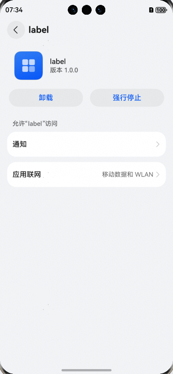

# 集成能力快速入门

# prompt

## 简介

本接口提供消息提示能力。


### 使用

 ```typescript
    import { prompt } from 'base_apis'
    
    @Entry
    @Component
    struct Index {
      build() {
        Button('showToast')
          .onClick(() => {
            prompt('内容提示')
          })
      }
    }
 ```

## 接口

prompt(str: ResourceStr)

# jumpToAppSettings

## 简介
本接口提供拉起应用信息页的能力。



### 使用

 ```typescript
    import { jumpToAppSettings } from 'base_apis'
    import { common } from '@kit.AbilityKit'
    
    @Entry
    @Component
    struct Index {
    build() {
    Button('jump')
      .onClick(() => {
        jumpToAppSettings(getContext(this) as common.UIAbilityContext)
      })
    }
    }
 ```

## 接口
jumpToAppSettings(context: common.UIAbilityContext)
