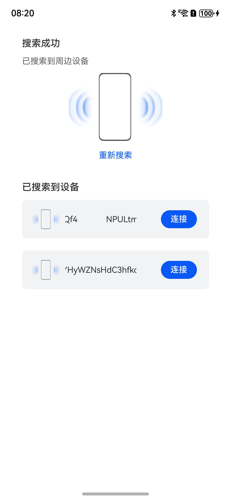

# 蓝牙扫描组件快速入门

## 目录

- [简介](#简介)
- [约束与限制](#约束与限制)
- [快速入门](#快速入门)
- [API参考](#API参考)
- [示例代码](#示例代码)
- [权限要求](#权限要求)

## 简介

本组件模块提供了2个单独的组件分别提供蓝牙扫描、扫描信息展示的能力，可以帮助开发者快速集成蓝牙相关的能力，开发者可以按需取用。



## 约束与限制

### 环境

- DevEco Studio版本：DevEco Studio 5.0.4 Release及以上
- HarmonyOS SDK版本：HarmonyOS 5.0.4 Release SDK及以上
- 设备类型：华为手机（直板机）
- HarmonyOS版本：HarmonyOS 5.0.4 Release及以上

### 调试
本组件不支持使用模拟器调试，请使用真机进行调试。

## 快速入门

1. 安装组件。  
   如果是在DevEvo Studio使用插件集成组件，则无需安装组件，请忽略此步骤。
   如果是从生态市场下载组件，请参考以下步骤安装组件。  
   a. 解压下载的组件包，将包中所有文件夹拷贝至您工程根目录的xxx目录下。  
   b. 在项目根目录build-profile.json5并添加bluetooth_scan和base_apis模块。
   ```typescript
   // 在项目根目录build-profile.json5填写bluetooth_scan和base_apis路径，其中xxx为组件存在的目录名
   "modules": [
      {
        "name": "base_apis",
        "srcPath": "./xxx/base_apis",
      },
      {
        "name": "bluetooth_scan",
        "srcPath": "./xxx/bluetooth_scan"
      }
   ]
   ```
   c. 在项目根目录oh-package.json5中添加依赖
   ```typescript
   // xxx为组件存放的目录名称
   "dependencies": {
      "bluetooth_scan": "file:../xxx/bluetooth_scan"
   }
   ```
2. 引入组件。
   ```typescript
   import { BleScannedDevicesView, BleScanView, BleScanViewModel } from 'bluetooth_scan';
   ```

3. 调用组件，详细参数配置说明参见[API参考](#API参考)。

   ```typescript
   import { BleScannedDevicesView, BleScanView, BleScanViewModel } from 'bluetooth_scan';

   @Entry
   @Component
   struct Index {
      pathStack: NavPathStack = new NavPathStack()
      bleScanViewModel: BleScanViewModel = new BleScanViewModel()
   
      build() {
        Column(){
          BleScanView({ pathStack: this.pathStack, bleScanViewModel: this.bleScanViewModel })
          BleScannedDevicesView({ pathStack: this.pathStack, bleScanViewModel: this.bleScanViewModel })
        }
        .width('100%')
        .height('100%')
      }
   }
   ```

## API参考

### 子组件

无

### 接口

BleScanView(options?: BleScanViewOptions)

蓝牙扫描组件。

BleScannedDevicesView(options?: BleScanViewOptions)

扫描信息展示组件。

**参数：**

| 参数名     | 类型                                            | 必填 | 说明           |
|---------|-----------------------------------------------|----|--------------|
| options | [BleScanViewOptions](#BleScanViewOptions对象说明) | 是  | 配置蓝牙扫描组件的参数。 |

### BleScanViewOptions对象说明

| 名称               | 类型                                                                                                                              | 必填 | 说明                          |
|------------------|---------------------------------------------------------------------------------------------------------------------------------|----|-----------------------------|
| pathStack        | [NavPathStack](https://developer.huawei.com/consumer/cn/doc/harmonyos-references/ts-basic-components-navigation#navpathstack10) | 是  | Navigation路由栈               |
| bleScanViewModel | [BleScanViewModel](#BleScanViewModel对象说明)                                                                                       | 是  | 蓝牙扫描类，构建时可传入过滤信息，内置参数接收扫描信息 |

### BleScanViewModel对象说明

| 名称                | 类型       | 必填 | 说明            |
|-------------------|----------|----|---------------|
| deviceNamesToScan | string[] | 否  | 非必填，扫描时过滤的设备名 |


## 示例代码

### 示例1（设置设备过滤名称）

本示例通过设置设备过滤名称实现只扫描发现需要的组件。

```typescript
   import { BleScannedDevicesView, BleScanView, BleScanViewModel } from 'bluetooth_scan';

   @Entry
   @Component
   struct Index {
      pathStack: NavPathStack = new NavPathStack()
      // 周边有"HUAWEI Band 7-E09"名称的蓝牙设备才能搜到
      bleScanViewModel: BleScanViewModel = new BleScanViewModel(['HUAWEI Band 7-E09'])
   
      build() {
         Column(){
            BleScanView({ pathStack: this.pathStack, bleScanViewModel: this.bleScanViewModel })
            BleScannedDevicesView({ pathStack: this.pathStack, bleScanViewModel: this.bleScanViewModel })
         }
         .width('100%')
         .height('100%')
      }
   }
```


## 权限要求

* 蓝牙权限：ohos.permission.ACCESS_BLUETOOTH