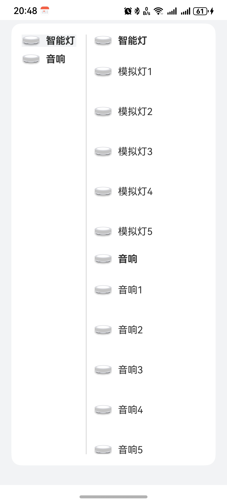

# 二级联动列表组件快速入门

## 目录

- [简介](#简介)
- [约束与限制](#约束与限制)
- [快速入门](#快速入门)
- [API参考](#API参考)
- [示例代码](#示例代码)

## 简介

本组件提供了展示二级分类列表的能力，可以帮助开发者快速集成分类列表相关的能力。



## 约束与限制

### 环境

- DevEco Studio版本：DevEco Studio 5.0.4 Release及以上
- HarmonyOS SDK版本：HarmonyOS 5.0.4 Release SDK及以上
- 设备类型：华为手机（直板机）
- HarmonyOS版本：HarmonyOS 5.0.4 Release及以上

## 快速入门

1. 安装组件。  
   如果是在DevEvo Studio使用插件集成组件，则无需安装组件，请忽略此步骤。
   如果是从生态市场下载组件，请参考以下步骤安装组件。  
   a. 解压下载的组件包，将包中所有文件夹拷贝至您工程根目录的xxx目录下。  
   b. 在项目根目录build-profile.json5并添加category_list模块。
   ```typescript
   // 在项目根目录build-profile.json5填写category_list路径,其中xxx为组件存在的目录名
   "modules": [
      {
        "name": "category_list",
        "srcPath": "./xxx/category_list"
      }
   ]
   ```
   c. 在项目根目录oh-package.json5中添加依赖
   ```typescript
   // xxx为组件存放的目录名称
   "dependencies": {
      "category_list": "file:../xxx/category_list"
   }
   ```

2. 引入组件。
   ```typescript
   import { TwoLevelListView } from 'category_list';
   ```

3. 调用组件，详细参数配置说明参见[API参考](#API参考)。

   ```typescript
   import { TwoLevelListView } from 'category_list';

   @Entry
   @ComponentV2
   struct Index {
      @Local level2ItemNum: number[] = [3, 4]
   
      @Builder level1Builder(level1Index: number) {
        Row(){
          Text('一级分类'+level1Index)
        }
        .backgroundColor(Color.Orange)
        .width('100%')
      }
   
      @Builder level2Builder(level1Index: number, level2Index: number) {
        Row() {
          Row() {
            Text('一级'+level1Index+' 二级'+level2Index)
          }
          .height(50)
        }
        .width('100%')
        .backgroundColor(Color.Pink)
        .justifyContent(FlexAlign.Start)
        .height(50)
        .margin({top: 6})
      }
   
      build() {
        Column() {
          TwoLevelListView({
            level2ItemNum:this.level2ItemNum,
            listSpace:1,
            level1ItemBuilder: this.level1Builder.bind(this),
            level2ItemBuilder: this.level2Builder.bind(this)
          })
        }
        .width('100%')
        .height('100%')
      }
   }
   ```

## API参考

### 子组件

无

### 接口

TwoLevelListView(options?: TwoLevelListViewOptions)

二级分类列表组件。

**参数：**

| 参数名     | 类型                                                      | 必填 | 说明             |
|---------|---------------------------------------------------------|----|----------------|
| options | [TwoLevelListViewOptions](#TwoLevelListViewOptions对象说明) | 是  | 配置二级分类列表组件的参数。 |

### TwoLevelListViewOptions对象说明

| 名称                | 类型                                                                                               | 必填 | 说明                                   |
|-------------------|--------------------------------------------------------------------------------------------------|----|--------------------------------------|
| level2ItemNum     | number[]                                                                                         | 是  | 记录每级分类的数量，数组长度表示一级分类数量，数组项表示对应二级分类数量 |
| level1ItemBuilder | [BuilderParam](https://developer.huawei.com/consumer/cn/doc/harmonyos-guides/arkts-builderparam) | 是  | 一级分类构建函数                             |
| level1ItemBuilder | [BuilderParam](https://developer.huawei.com/consumer/cn/doc/harmonyos-guides/arkts-builderparam) | 是  | 二级分类构建函数                             |
| listSpace         | number                                                                                           | 否  | 列表项之间的间隙，默认15                        |

## 示例代码

### 示例1（二级分类增加图片显示）

本示例通过修改二级分类的builderParam给二级分类增加图片显示。

```typescript
   import { TwoLevelListView } from 'category_list';
   
   @Entry
   @ComponentV2
   struct CategoryList {
     @Local level2ItemNum: number[] = [5, 5]
     private firstEnum: string[] = ["智能灯", "音响"];
     private secondEnum: object[] = [["模拟灯1", "模拟灯2", "模拟灯3", "模拟灯4", "模拟灯5"], ["音响1", "音响2", "音响3", "音响4", "音响5"]];
   
     @Builder level1Builder(level1Index: number) {
       Row(){
         Image($r('app.media.light'))
           .size({ width: 30 })
         Text(this.firstEnum[level1Index])
           .fontWeight(FontWeight.Bold)
           .margin({left: 10})
       }
       .width(90)
     }
   
     @Builder level2Builder(level1Index: number, level2Index: number) {
       Row() {
         Row() {
           Image($r('app.media.light'))
             .size({ width: 30 })
           Text(this.secondEnum[level1Index][level2Index])
             .margin({left: 10})
         }
         .height(50)
       }
       .width('100%')
       .justifyContent(FlexAlign.Start)
       .height(50)
       .margin({top: 6})
     }
   
     build() {
       Column() {
         Row() {
           Row() {
             TwoLevelListView({
               level2ItemNum:this.level2ItemNum,
               listSpace:10,
               level1ItemBuilder: this.level1Builder.bind(this),
               level2ItemBuilder: this.level2Builder.bind(this)
             })
           }
           .height('95%')
           .width('90%')
         }
         .justifyContent(FlexAlign.Center)
         .height('95%')
         .width('90%')
         .backgroundColor('#FFFFFF')
         .borderRadius(16)
         .margin({top: 6})
       }
       .width('100%')
       .height('100%')
       .backgroundColor('#F1F3F5')
     }
   }
```

