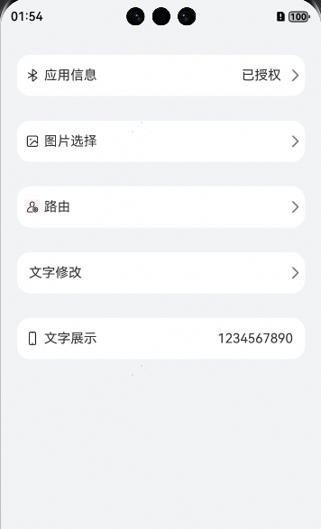

# 简易表单组件快速入门

## 目录

- [简介](#简介)
- [约束与限制](#约束与限制)
- [快速入门](#快速入门)
- [API参考](#API参考)
- [示例代码](#示例代码)

## 简介

本组件提供了各种表单的能力，包括打开应用信息表单、图片选择表单、路由跳转表单、文字输入表单、文字展示表单。


## 约束与限制

### 环境

- DevEco Studio版本：DevEco Studio 5.0.4 Release及以上
- HarmonyOS SDK版本：HarmonyOS 5.0.4 Release SDK及以上
- 设备类型：华为手机（直板机）
- HarmonyOS版本：HarmonyOS 5.0.4 Release及以上

## 快速入门

1. 安装组件。  
   如果是在DevEvo Studio使用插件集成组件，则无需安装组件，请忽略此步骤。
   如果是从生态市场下载组件，请参考以下步骤安装组件。  
   a. 解压下载的组件包，将包中所有文件夹拷贝至您工程根目录的xxx目录下。
   b. 在项目根目录build-profile.json5并添加form_bar和base_apis模块。
   ```typescript
   // 在项目根目录build-profile.json5填写form_bar和base_apis路径，其中xxx为组件存在的目录名
   "modules": [
      {
        "name": "base_apis",
        "srcPath": "./xxx/base_apis"
      },
      {
        "name": "form_bar",
        "srcPath": "./xxx/form_bar"
      }
   ]
   ```
   c. 在项目根目录oh-package.json5中添加依赖
   ```typescript
   // xxx为组件存放的目录名称
   "dependencies": {
      "form_bar": "file:../xxx/form_bar"
   }
   ```

2. 引入组件。
   ```typescript
   import { FormBar, FormType } from 'form_bar';
   ```

3. 调用组件，详细参数配置说明参见[API参考](#API参考)。

   ```typescript
   import { FormBar, FormType } from 'form_bar';
   
   @Entry
   @ComponentV2
   struct Index {
      @Local avatar: ResourceStr = ''
      @Local pathStack: NavPathStack = new NavPathStack();
      @Local name: string = '';
      @Local phone: string = '1234567890';
      build() {
        Navigation(this.pathStack) {
          Row(){
            FormBar({
              formType: FormType.ACCESS_SETTING,
              startImage: $r('app.media.bluetooth'),
              name: '蓝牙',
              value: '已授权',
            })
          }
          .FormStyle()
        }
        .width('100%')
        .height('100%')
        .backgroundColor('#F1F3F5');
      }
   
      @Styles
      FormStyle() {
        .height(50)
        .width('90%')
        .borderRadius(16)
        .backgroundColor(Color.White)
        .margin({ top: 30 });
      }
   }
   ```

## API参考

### 子组件

无

### 接口

FormBar(options?: FormBarOptions)

表单组件。

**参数：**

| 参数名     | 类型                                    | 必填 | 说明         |
|---------|---------------------------------------|----|------------|
| options | [FormBarOptions](#FormBarOptions对象说明) | 是  | 配置表单组件的参数。 |

### FormBarOptions对象说明

| 名称            | 类型                                                                                                    | 必填 | 说明                                          |
|---------------|-------------------------------------------------------------------------------------------------------|----|---------------------------------------------|
| fromType      | [FormType](#FormType对象说明)                                                                             | 是  | 表单类型枚举值                                     |
| startImage    | [ResourceStr](https://developer.huawei.com/consumer/cn/doc/harmonyos-references/ts-types#resourcestr) | 否  | 表达项开头位置图片                                   |
| name          | string                                                                                                | 是  | 表单展示名称                                      |
| value         | [ResourceStr](https://developer.huawei.com/consumer/cn/doc/harmonyos-references/ts-types#resourcestr) | 否  | 表单值                                         |
| valueChangeCb | (value:ResourceStr)=>void                                                                             | 否  | 值修改回调，FormType为IMAGE_SETTING或TEXT_SETTING必传 |
| pathStack     | NavPathStack                                                                                          | 否  | 路由栈，FormType为NAV必传                          |
| pageName      | string                                                                                                | 否  | 跳转页面名称，FormType为NAV必传                       |
| maxLength     | number                                                                                                | 否  | 最大输入长度，FormType为TEXT_SETTING可传，默认为8         |

### FormType对象说明

| 枚举值            | 说明      |
|----------------|---------|
| ACCESS_SETTING | 跳转应用信息类 |
| IMAGE_SETTING  | 图片选择类   |
| NAV            | 路由跳转类   |
| TEXT_SETTING   | 文字修改类   |
| TEXT_SHOW      | 文字展示类   |


## 示例代码

### 示例1（展示所有类型的表单）

本示例遍历展示了所有类型的表单，开发者可按需取用。

```typescript
   import { FormBar, FormType } from 'form_bar';
   
   @Entry
   @ComponentV2
   struct Index {
      @Local avatar: ResourceStr = ''
      @Local pathStack: NavPathStack = new NavPathStack();
      @Local name: string = '';
      @Local phone: string = '1234567890';
      build() {
         Navigation(this.pathStack) {
            Row(){
               FormBar({
                  formType: FormType.ACCESS_SETTING,
                  startImage: $r('app.media.bluetooth'),
                  name: '应用信息',
                  value: '已授权',
               })
            }
            .FormStyle()
            Row(){
               FormBar({
                  formType: FormType.IMAGE_SETTING, // 选择IMAGE_SETTING类型，valueChangeCb 必传
                  startImage: $r('app.media.picture'),
                  name: '图片选择',
                  value: this.avatar,
                  valueChangeCb: (value: ResourceStr) => {
                     this.avatar = value
                  },
               })
            }
            .FormStyle()
            Row(){
               FormBar({
                  formType: FormType.NAV,
                  pathStack: this.pathStack,
                  startImage:  $r('app.media.bluetooth'),
                  name: '路由',
                  pageName: 'config', // 这里config为示例，需要修改为真实页面名称
               })
            }
            .FormStyle()
            Row(){
               FormBar({
                  formType: FormType.TEXT_SETTING, // 选择TEXT_SETTING类型，valueChangeCb 必传
                  name: '文字修改',
                  value: this.name,
                  valueChangeCb: (value: ResourceStr) => {
                     this.name = value as string;
                  }
               })
            }
            .FormStyle()
            Row(){
               FormBar({
                  formType: FormType.TEXT_SHOW,
                  startImage: $r('app.media.account'),
                  name: '文字展示',
                  value: this.phone
               })
            }
            .FormStyle()
         }
         .width('100%')
         .height('100%')
         .backgroundColor('#F1F3F5');
      }
   
      @Styles
      FormStyle() {
         .height(50)
         .width('90%')
         .borderRadius(16)
         .backgroundColor(Color.White)
         .margin({ top: 30 });
      }
   }
```

