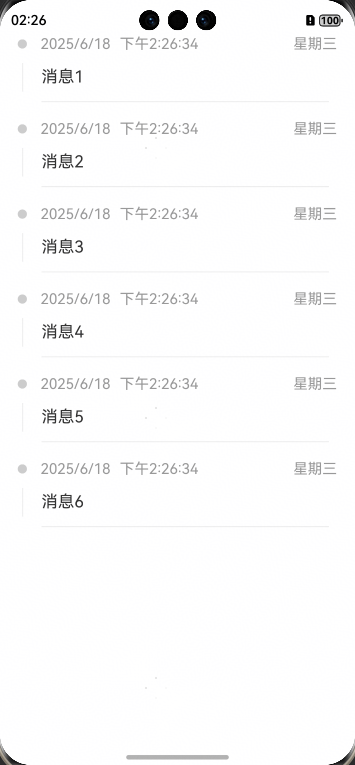

# 消息列表快速入门

## 目录

- [简介](#简介)
- [约束与限制](#约束与限制)
- [快速入门](#快速入门)
- [API参考](#API参考)

## 简介

本组件提供了消息列表组件展示的能力



## 约束与限制

### 环境

- DevEco Studio版本：DevEco Studio 5.0.4 Release及以上
- HarmonyOS SDK版本：HarmonyOS 5.0.4 Release SDK及以上
- 设备类型：华为手机（直板机）
- HarmonyOS版本：HarmonyOS 5.0.4 Release及以上

## 快速入门

1. 安装组件。  
   如果是在DevEvo Studio使用插件集成组件，则无需安装组件，请忽略此步骤。
   如果是从生态市场下载组件，请参考以下步骤安装组件。  
   a. 解压下载的组件包，将包中所有文件夹拷贝至您工程根目录的xxx目录下。  
   b. 在项目根目录build-profile.json5并添加message_list模块。
   ```typescript
   // 在项目根目录build-profile.json5填写message_list路径，其中xxx为组件存在的目录名
   "modules": [
       {
         "name": "message_list",
         "srcPath": "./xxx/message_list"
       }
   ]
   ```
   c. 在项目根目录oh-package.json5中添加依赖
   ```typescript
   // xxx为组件存放的目录名称
   "dependencies": {
      "message_list": "file:../xxx/message_list"
   }
   ```

2. 引入组件。
   ```typescript
   import { MessageList, MessageRecordViewModel } from 'message_list';
   ```

3. 调用组件，详细参数配置说明参见[API参考](#API参考)。

   ```typescript
   import { MessageList, MessageRecordViewModel } from 'message_list';
   
   @Entry
   @ComponentV2
   struct Index {
      messageList:MessageRecordViewModel[] = [
        new MessageRecordViewModel('消息1',new Date()),
        new MessageRecordViewModel('消息2',new Date()),
        new MessageRecordViewModel('消息3',new Date()),
        new MessageRecordViewModel('消息4',new Date()),
        new MessageRecordViewModel('消息5',new Date()),
        new MessageRecordViewModel('消息6',new Date()),
      ]
      build() {
        Column() {
          MessageList({
            messageList:this.messageList
          })
          .width('90%')
        }
        .width('100%')
        .height('100%')
      }
   }
   ```

## API参考

### 子组件

无

### 接口

MessageList(options?: MessageListOptions)

消息列表组件。

**参数：**

| 参数名     | 类型                                            | 必填 | 说明           |
|---------|-----------------------------------------------|----|--------------|
| options | [MessageListOptions](#MessageListOptions对象说明) | 是  | 配置消息列表组件的参数。 |

### MessageListOptions对象说明

| 名称          | 类型                                                  | 必填 | 说明   |
|-------------|-----------------------------------------------------|----|------|
| messageList | [MessageRecordViewModel[]](#MessageListOptions对象说明) | 是  | 消息列表 |

### MessageRecordViewModel对象说明

| 名称      | 类型     | 必填 | 说明   |
|---------|--------|----|------|
| message | string | 是  | 消息内容 |
| date    | Date   | 是  | 消息时间 |