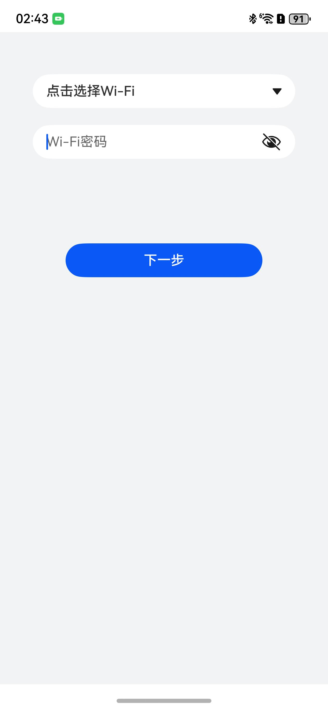
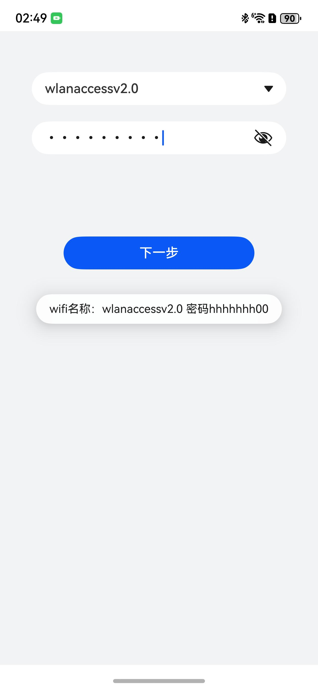

# wifi扫描选择组件快速入门

## 目录

- [简介](#简介)
- [约束与限制](#约束与限制)
- [快速入门](#快速入门)
- [API参考](#API参考)
- [示例代码](#示例代码)
- [权限要求](#权限要求)

## 简介

本组件提供了wifi选择的能力，包括wifi列表选择，密码展示等



## 约束与限制

### 环境

- DevEco Studio版本：DevEco Studio 5.0.4 Release及以上
- HarmonyOS SDK版本：HarmonyOS 5.0.4 Release SDK及以上
- 设备类型：华为手机（直板机）
- HarmonyOS版本：HarmonyOS 5.0.4 Release及以上

## 快速入门

1. 安装组件。  
   如果是在DevEvo Studio使用插件集成组件，则无需安装组件，请忽略此步骤。
   如果是从生态市场下载组件，请参考以下步骤安装组件。  
   a. 解压下载的组件包，将包中所有文件夹拷贝至您工程根目录的xxx目录下。  
   b. 在项目根目录build-profile.json5并添加wifi_scan模块。
   ```typescript
   // 在项目根目录build-profile.json5填写wifi_scan路径，其中xxx为组件存在的目录名
   "modules": [
       {
          "name": "wifi_scan",
          "srcPath": "./xxx/wifi_scan"
       }
   ]
   ```
   c. 在项目根目录oh-package.json5中添加依赖
   ```typescript
   // xxx为组件存放的目录名称
   "dependencies": {
      "wifi_scan": "file:../xxx/wifi_scan"
   }
   ```

2. 引入组件。
   ```typescript
   import { MessageList, MessageRecordViewModel } from 'message_list';
   ```

3. 调用组件，详细参数配置说明参见[API参考](#API参考)。

   ```typescript
   import { WifiSelectView } from 'wifi_scan';
   
   @Entry
   @ComponentV2
   struct Index {
      build() {
        Column() {
          WifiSelectView()
        }
        .backgroundColor('#F1F3F5')
        .width('100%')
        .height('100%')
      }
   }
   ```

## API参考

### 子组件

无

### 接口

WifiSelectView()

Wifi选择组件。

**参数：**

无

### 事件

支持以下事件：

#### clickEvent

clickEvent(wifiName: string, wifiPassword: string) => void

点击下一步回调事件，返回当前选择的wifi名称和密码

## 示例代码

### 示例1（传入点击协议回调和登录回调）

本示例展示了调用回调事件的用法。

```typescript
   import { WifiSelectView } from 'wifi_scan'
   import { promptAction } from '@kit.ArkUI'
   
   @Entry
   @ComponentV2
   struct Index {
      build() {
         Column() {
            WifiSelectView({
               clickEvent: (wifiName: string, wifiPassWord) => {
                 // 按钮点击事件
                  promptAction.showToast({ message: 'wifi名称：' + wifiName + ' 密码' + wifiPassWord })
               }
            })
         }
         .backgroundColor('#F1F3F5')
            .width('100%')
            .height('100%')
      }
   }
```



## 权限要求

* wifi查询权限：ohos.permission.GET_WIFI_INFO