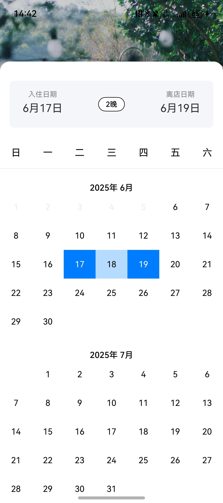

# 日历组件快速入门

## 目录

- [简介](#简介)
- [约束与限制](#约束与限制)
- [快速入门](#快速入门)
- [API参考](#API参考)
- [示例代码](#示例代码)

## 简介

本组件提供入住、离开日期选择的功能。



## 约束与限制
### 环境
* DevEco Studio版本：DevEco Studio 5.0.1 Release及以上
* HarmonyOS SDK版本：HarmonyOS 5.0.1 Release SDK及以上
* 设备类型：华为手机（直板机）
* HarmonyOS版本：HarmonyOS 5.0.1(13)及以上

### 权限
* 无

## 快速入门

1. 安装组件。
   如果是在DevEvo Studio使用插件集成组件，则无需安装组件，请忽略此步骤。

   如果是从生态市场下载组件，请参考以下步骤安装组件。

   a. 解压下载的组件包，将包中所有文件夹拷贝至您工程根目录的xxx目录下。

   b. 在项目根目录build-profile.json5并添加calendar_select模块
   ```
   "modules": [
   {
      "name": "calendar_select",
      "srcPath": "./xxx/calendar_select",
      }
   ]
   ```
   c. 在项目根目录oh-package.json5中添加依赖
   ```
   "dependencies": {
      "calendar_select": "file:./xxx/calendar_select"
   }
   ```
   
2. 引入组件。

   ```
   import { DateInfo } from 'calendar_select';
   ```

## API参考

### 接口
DateInfo(startDate:DateModel,endDate:DateModel,night:number,isShowPrice:boolean,priceList:Price)

日历组件。

#### 参数说明

| 参数名         | 类型                          | 是否必填 | 说明       |
|:------------|:----------------------------|:---|:---------|
| startDate   | [DateModel](#DateModel对象说明) | 是  | 初始开始日期   |
| endDate     | [DateModel](#DateModel对象说明) | 是  | 初始结束日期   |
| night       | number                      | 是  | 晚数       |
| isShowPrice | boolean                     | 是  | 是否展示价格日历 |
| priceList   | [Price](#Price对象说明)       | 是  | 价格日历     |

#### DateModel对象说明

| 参数名       | 类型     | 是否必填 | 说明   |
|:----------|:-------|:---|:-----|
| day      | number | 是  | 天数   |
| week | number | 是  | 起始时间 |
| month   | number | 是  | 结束时间 |
| year   | number | 是  | 结束时间 |

#### Price对象说明

| 参数名                | 类型            | 是否必填 | 说明 |
|:-------------------|:--------------|:---|:---|
| date              | string    | 是  | 日期 |
| price      | number | 是  | 价格 |

## 示例代码

```
import { hilog } from '@kit.PerformanceAnalysisKit';
import { CalendarUtil, DateInfo, DateModel, getLastDayOfMonth, getRealTimeDate } from 'calendar_select';

@Entry
@Component
export struct Home {
  @StorageLink('night') night: number = CalendarUtil.getNight() ?? 1;
  @StorageLink('startDate') startDate: DateModel | undefined = CalendarUtil.getStartDate();
  @StorageLink('endDate') endDate: DateModel | undefined = CalendarUtil.getEndDate();
  @State currentMonth: number | undefined = CalendarUtil.getCurrentDate()?.month;
  @State currentDay: number | undefined = CalendarUtil.getCurrentDate()?.day;
  @State currentYear: number | undefined = CalendarUtil.getCurrentDate()?.year;
  
  aboutToAppear(): void {
    // 首次初始化
    let dates: Promise<undefined> = new Promise(() => {
      if (!AppStorage.get('startDate') && !AppStorage.get('endDate')) {
        this.startDate = getRealTimeDate();
        let date = new Date();
        let days = getLastDayOfMonth(this.currentYear ?? date.getFullYear(),
          this.currentMonth ?? date.getMonth());
        if (this.startDate.day >= days) {
          this.endDate =
            new DateModel(this.startDate.day - days + 1, this.startDate.week, this.startDate.month + 1,
              this.startDate.year);
        } else {
          this.endDate =
            new DateModel(this.startDate.day + 1, this.startDate.week, this.startDate.month, this.startDate.year);
        }

        AppStorage.setOrCreate('currentDate', this.startDate);
        AppStorage.setOrCreate('startDate', this.startDate);
        AppStorage.setOrCreate('endDate', this.endDate);
      }
    });

    dates.then(() => {
      hilog.info(0xff00, 'Sample', 'init date success');
    });
  }

  build() {
    Column() {
      DateInfo(
        {
          startDate: this.startDate,
          endDate: this.endDate,
          night: this.night,
          isShowPrice: false,
          priceList: [],
        },
      )
        .backgroundColor('#f5f6fa')
        .borderRadius(8);
    };
  }
}
```
