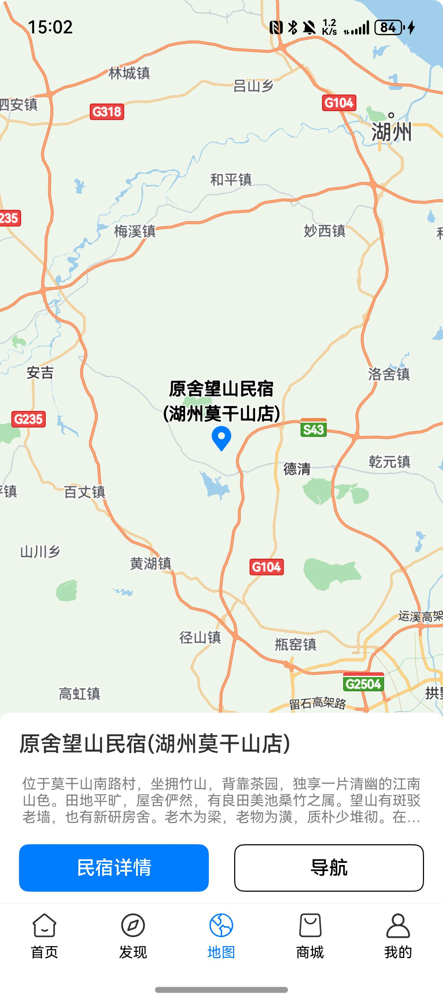
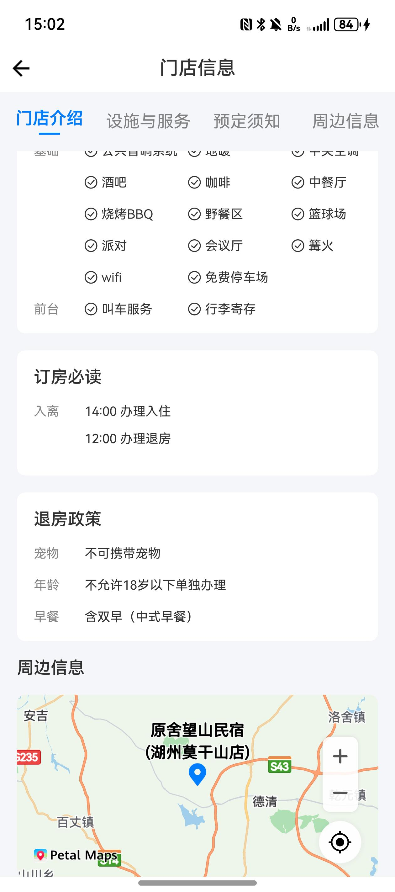

# 地图（定位选点）组件快速入门

## 目录

- [简介](#简介)
- [约束与限制](#约束与限制)
- [快速入门](#快速入门)
- [API参考](#API参考)
- [示例代码](#示例代码)

## 简介

本组件提供地图展示能力，并支持地图定位和选点定制功能。

| 全屏地图                           | 嵌入式地图                          |
|--------------------------------|--------------------------------|
|  |  |

## 约束与限制
### 环境
* DevEco Studio版本：DevEco Studio 5.0.1 Release及以上
* HarmonyOS SDK版本：HarmonyOS 5.0.1 Release SDK及以上
* 设备类型：华为手机（直板机）
* HarmonyOS版本：HarmonyOS 5.0.1(13)及以上

### 权限
- 获取位置权限：ohos.permission.APPROXIMATELY_LOCATION、ohos.permission.LOCATION。

## 快速入门
1. 安装组件。
   如果是在DevEvo Studio使用插件集成组件，则无需安装组件，请忽略此步骤。

   如果是从生态市场下载组件，请参考以下步骤安装组件。

   a. 解压下载的组件包，将包中所有文件夹拷贝至您工程根目录的xxx目录下。

   b. 在项目根目录build-profile.json5并添加travel_map模块
   ```
   "modules": [
   {
      "name": "travel_map",
      "srcPath": "./xxx/travel_map",
      }
   ]
   ```
   c. 在项目根目录oh-package.json5中添加依赖
   ```
   "dependencies": {
      "travel_map": "file:./xxx/travel_map"
   }
   ```

2. 引入组件。

   ```
   import { CommonMap } from 'travel_map';
   ```

3. 配置地图相关权限。

   a.在主工程的module.json5文件中配置如下地图相关权限。
   ```
   "requestPermissions": [
      {
        "name": "ohos.permission.LOCATION",
        "reason": "$string:app_name",
        "usedScene": {
          "abilities": [
            "EntryAbility"
          ],
          "when": "inuse"
        }
      },
      {
        "name": "ohos.permission.APPROXIMATELY_LOCATION",
        "reason": "$string:app_name",
        "usedScene": {
          "abilities": [
            "EntryAbility"
          ],
          "when": "inuse"
        }
      }
    ],
   ```
   
   b.将应用的client ID配置到主工程模块的src/main/module.json5文件，详细参考：[配置Client ID](https://developer.huawei.com/consumer/cn/doc/harmonyos-guides/account-client-id)。

## API参考

### 接口
CommonMap(travelMapOptions: TravelMapOptions)

地图选点组件。

#### 参数说明

| 参数名              | 类型                    | 是否必填 | 说明     |
|:-----------------|:----------------------|:-----|:-------|
| travelMapOptions       | [TravelMapOptions](#TravelMapOptions对象说明) | 是    | 地图选点详情 |

#### TravelMapOptions对象说明

| 参数名              | 类型            | 是否必填 | 说明       |
|:-----------------|:--------------|:---|:---------|
| location       | [Location](#Location类型说明)      | 是  | 位置信息     |
| icon       | ResourceStr   | 是  | 标记点图标    |
| titleOptions       | [TitleOptions](#TitleOptions类型说明)  | 是  | 标记点名称属性  |
| cameraSpeed       | number        | 是  | 相机定位移动速度 |
| zoom       | number        | 是  | 地图放大倍数   |
| height       | number/string | 是  | 地图高度     |
| pointClickCallBack       | () => void    | 是  | 标记点点击回调  |

#### Location类型说明

| 参数名       | 类型     | 是否必填 | 说明 |
|:----------|:-------|:---|:---|
| latitude  | number | 是  | 纬度 |
| longitude | number | 是  | 经度 |


#### TitleOptions类型说明

| 参数名                | 类型     | 是否必填 | 说明 |
|:-------------------|:-------|:---|:---|
| name              | string | 是  | 标记点名称 |
| strokeColor      | number | 是  | 标记点展示颜色 |

## 示例代码

```
import { CommonMap } from 'travel_map';
import { promptAction } from '@kit.ArkUI';

@Entry
@Component
export struct Home {
  build() {
    Column() {
      CommonMap(
        {
          travelMapOptions: {
            location: {
              latitude: 30.56,
              longitude: 119.89,
            },
            icon: $r('app.media.point'),
            titleOptions: {
              name: '原舍望山民宿',
              strokeColor: 0xFFFFFFFF,
            },
            cameraSpeed: 1000,
            zoom: 10,
            height: '100%',
            pointClickCallBack: () => {
              promptAction.showToast({ message: '点击标记点' });
            },
          },
        });
    };
  }
}
```
